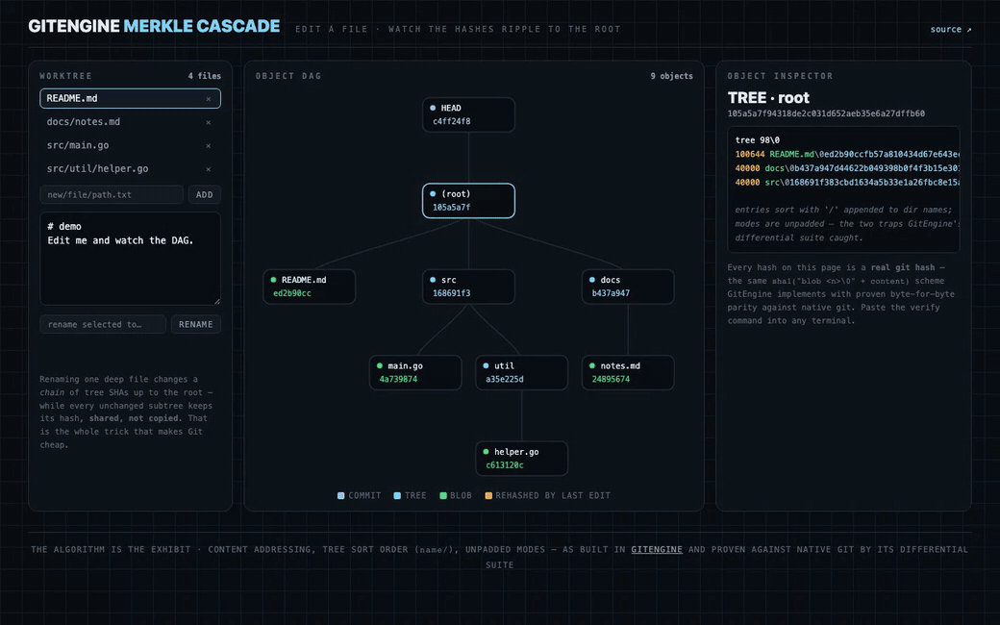
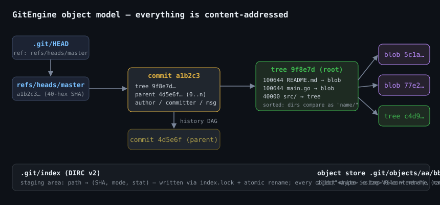
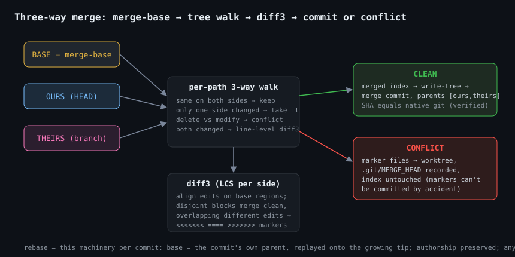

# GitEngine

Git's core, re-implemented from first principles in Go — content-addressed
object store, DIRC v2 index, refs/HEAD semantics, and the porcelain on top:
**17 commands** including three-way `merge` with real conflict detection,
`rebase` with preserved authorship, and `fsck`-grade integrity verification.

**[▶ Merkle Cascade — live playground](https://brickster241.github.io/GitEngine/)** —
edit a virtual worktree and watch real git hashes ripple to the root. Every SHA on the
page is verifiable against native git.



<details>
<summary><b>Terminal proof</b> — native git reading GitEngine's object store</summary>
<br>


</details>

The acceptance criterion is not "looks right" — it is **byte-for-byte agreement
with native Git**, enforced by a differential test suite that executes every
scenario twice (once with `git`, once with `gegit`) under pinned identities and
timestamps, then compares the resulting SHAs:

- commit chains (blob → tree → commit hashing, nested trees)
- `merge-base` on forked histories
- fast-forward merges (identical tips)
- **clean 3-way merges — the full merge COMMIT SHA matches git's**, including
  both-sides-edited-the-same-file merges resolved by line-level diff3
- conflicting merges (same conflicted file set, standard `<<<<<<<` markers)
- **rebase — the replayed TIP SHA matches git's** (author + author-date
  preserved, committer restamped, message bytes identical)
- `gegit fsck` certifying repositories written by *native git*



## Commands

| Layer | Commands |
|---|---|
| Plumbing | `hash-object` · `cat-file` · `update-index` · `write-tree` · `read-tree` · `ls-tree` |
| Porcelain | `init` · `add` · `status` · `commit` · `branch` · `checkout` · `log` · `config` |
| History surgery | `merge` (fast-forward + 3-way + `--abort`) · `rebase` |
| Integrity | `fsck` — re-hash every object, resolve every tree/commit reference |

## The merge machinery



`merge` finds the merge-base (BFS over the commit DAG), walks the union of
paths across base/ours/theirs, and resolves each: untouched sides pass
through, double-edits go to a line-level **diff3** (LCS alignment per side,
disjoint edit blocks merge clean, overlapping different edits emit standard
conflict markers). Clean merges commit with two parents; conflicts stop
*before* committing — marker files land in the worktree, `.git/MERGE_HEAD`
records the state for `merge --abort`, and the index deliberately stays
pre-merge so markers can never be committed by accident.

`rebase` replays the branch's commits one three-way cherry-pick at a time
(base = each commit's own parent), preserving author and author-date while
restamping the committer — and aborts atomically on conflict, before any ref
moves.

## Production behaviors

- **Index locking**: every index write goes through `.git/index.lock`
  (`O_CREAT|O_EXCL`) with bounded retry — the same protocol real Git uses.
  Measured: **8 parallel writers to one repository, 0 lost updates, index
  valid** (see `gebench`).
- **Atomic writes everywhere**: objects and the index are written to temp
  files and `rename(2)`d into place — a crash can never leave a torn object
  or index behind.
- **Integrity verification**: `gegit fsck` re-hashes every object against its
  SHA and resolves every tree/commit reference — **28,555 objects/sec** on an
  Apple M5, and it certifies repositories created by native git.
- **Reproducible commits**: `GIT_AUTHOR_DATE` / `GIT_COMMITTER_DATE` are
  honored exactly like real Git — the enabler for differential SHA testing.

## Measured performance (gebench)

Twin repositories, identical workloads, wall-clock, Apple M5. `gebench`
builds the corpus deterministically so runs are comparable:

| Scenario | gegit | native git | ratio |
|---|---|---|---|
| Ingest 2,000 files (add + commit) | **349 ms** | 706 ms | **0.49× — 2× faster** |
| `status` on a clean 2,000-file tree | 43.5 ms | 17.2 ms | 2.54× |
| `fsck` over the full object store | 99.1 ms | 88.5 ms | 1.12× |
| `log --oneline`, 500-commit chain | 25.5 ms | 15.8 ms | 1.62× |
| 8 parallel writers, one index | 7.1 ms | — | 0 lost updates |

*(The ingest win is real but has an honest explanation: git performs extra
durability work — fsync discipline, hooks, advice — that gegit does not.
Being within ~1–2.5× of native git everywhere else, with the same on-disk
formats, is the story.)*

```bash
go build -o bin/gegit ./cmd && go build -o bin/gebench ./cmd/gebench
./bin/gebench -gegit bin/gegit            # ge-vs-git table
go test ./...                             # unit + differential suites (needs git in PATH)
```

## Try it

```bash
./bin/gegit init && echo hello > a.txt
./bin/gegit add a.txt && ./bin/gegit commit -m "first"
./bin/gegit branch feature && ./bin/gegit checkout feature
echo feature-work > b.txt && ./bin/gegit add b.txt && ./bin/gegit commit -m "feat"
./bin/gegit checkout master && ./bin/gegit merge feature   # fast-forward
./bin/gegit log --oneline
./bin/gegit fsck
# conflicts: edit the same line on two branches, merge, observe <<<<<<< markers,
# then `gegit merge --abort` to restore.
```

Interop is a two-way street because the formats are the bytes themselves:
`git log`, `git status`, and `git fsck` all run clean inside a gegit-created
repository, and vice versa.

## Design notes

- One package per responsibility: `plumbing` (object store, index, refs,
  trees, merge/diff3 machinery), `porcelain` (user-facing commands),
  `difftest` (the differential harness), `cmd/gebench` (benchmarks).
- The differential suite is the project's conscience: two of its first
  catches were real byte-compat bugs — tree modes were zero-padded
  (`040000` vs git's `40000`) and tree entries sorted by plain name instead
  of git's directories-sort-as-`name/` rule. Both now carry regression
  coverage.
- Scope decisions: loose objects only (no packfiles/delta compression), no
  network protocols (clone/fetch/push), single index stage on conflict
  (markers in worktree instead of stage 1/2/3 entries). Each is a deliberate
  next milestone, not an accident.
